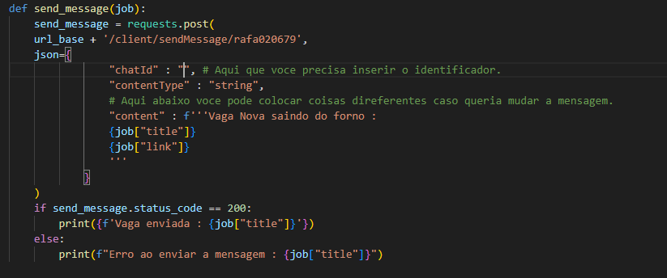
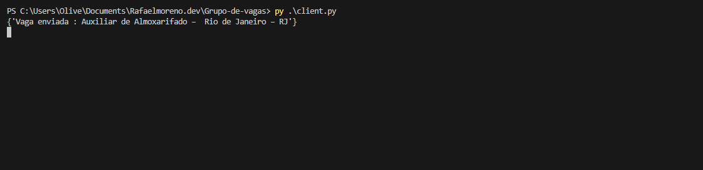

# Grupo de Vagas - Envio Automatizado de Vagas via WhatsApp

Este projeto permite o envio automatizado de informações sobre vagas de emprego para grupos e contatos do WhatsApp, utilizando uma API de terceiros. No exemplo, usamos a API de WhatsApp de Chris Hubert, que você pode encontrar [aqui](https://github.com/chrishubert/whatsapp-api).

## Funcionalidades

1. **Envio automatizado de vagas**: Lê vagas de um arquivo `.txt` e envia cada vaga a um grupo ou contato do WhatsApp.
2. **Conexão rápida**: Configuração para conexão simples e rápida com o WhatsApp via QR Code.
3. **Intervalo de envio configurável**: Define intervalos entre envios para evitar spam.

---

## Configuração da API do WhatsApp

Primeiro, é necessário configurar a API do WhatsApp localmente:

1. Clone o repositório:
   ```bash
    git clone https://github.com/chrishubert/whatsapp-api.git
    cd whatsapp-api
   ```
2. Instale as dependências:

```bash
  npm install
```

3. Configure as variáveis de ambiente:

```bash
  cp .env.example .env
```

4. Atualize as variáveis conforme necessário.
   Inicie a API:

```bash
  npm run start
```

A API estará acessível em http://localhost:3000.

## Conexão com o WhatsApp

Para conectar seu WhatsApp à API, execute o comando abaixo em um terminal separado:

```bash
curl http:localhost:3000/api/startSession/{IDENTIFICADOR_DE_SESSÃO}
```

Substitua {IDENTIFICADOR_DE_SESSÃO} por um identificador único, como "ABCD". Após isso, escaneie o QR Code que aparecerá no terminal.

**Nota**: O uso de APIs de terceiros para WhatsApp pode acarretar em restrições ou até banimento de número.

## Configuração do Projeto de Envio de Vagas

1. Clone o projeto:

```bash
git clone https://github.com/Mean-Says/Grupo-de-vagas.git
cd Grupo-de-vagas
```

2. Criação de ambiente virtual:

```bash
python -m venv venv
```

Ative o ambiente virtual:

No Windows:

```bash
venv\Scripts\Activate
```

No macOS/Linux:

```bash
source venv/bin/activate
```

3. Instale as dependências:

```bash
pip install -r requirements.txt
```

## Scripts Principais

1. Obtenção dos Chats Disponíveis (GetChats.py)
   Este script lista os cinco chats mais recentes, retornando o nome e o identificador de cada chat. Use esse identificador para definir o envio.
   Execute o script:

```bash
python GetChats.py
```

2. Envio de Vagas (client.py)
   Configuração: No client.py, defina o ID do chat no campo chatId, o intervalo entre mensagens (time.sleep(180)) e o conteúdo da mensagem.



3. Arquivo de vagas: Crie um arquivo chamado jobs_results.txt e adicione vagas no formato JSON em cada linha:

```json
{ "title": "Desenvolvedor Backend", "link": "https://exemplo.com/vaga/backend" }
```

**NOTA** : Se deseja alguma forma de extrair está vaga voce pode considerar esse projeto [aqui](https://github.com/Mean-Says/LinkedIn-Job-Scraper-CLI) para te ajudar com isso.

Execução: Inicie o envio das vagas com:

```bash
python client.py
```

O terminal exibirá uma confirmação para cada vaga enviada:



## Considerações Finais

Use o projeto com responsabilidade, respeitando os limites e políticas do WhatsApp para evitar restrições. Para dúvidas ou contribuições, abra uma issue ou pull request no repositório.
